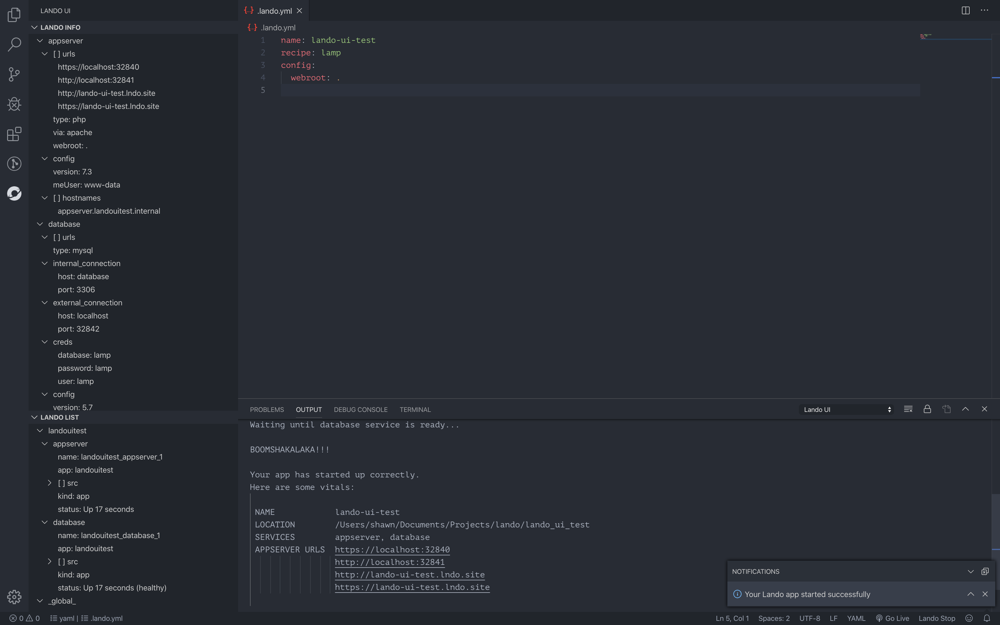

# Lando UI

Please leave a rating! Feedback is welcome!
Take the [survey](https://forms.gle/HH9wPoYor2rheUoS6) to help improve the extension.

## Features

Lando UI was designed to simplify the use of the Lando development tool when inside VSCode. It adds quick button shortcuts and information panels that allow quick, commandless access to your current Lando project, as well as other running projects/containers.

Visit the Lando website at https://lando.dev/

## Requirements

Lando UI requires that you have the lando tool installed and at a minimum version of v3.0.0-rc13. The `--format json` option was added in this release and is required for the functionality of this extension.

To install lando and it's dependencies follow the [installation instructions](https://docs.lando.dev/basics/installation.html) on their website.

## Abilities

### Multi Root

Allows for multiple workspace folders to be present. Switch back and forth with the "Change Workspace Folder" button and the interface will switch with you. Set a default workspace folder in your workspace settings so it can open the right lando project for you when you start VSCode.

### What's running?

See what running, whether it's the project your in or another project you forgot to spin down. Lando UI provides you quick access to stop other running projects from any instance of VSCode. You can also see information about the project you're currently in. Open project links in your default browser directly from the Info Panel. As well as copying project values, such as database credentials or urls, and ssh-ing into a service all with single click!

### Lando Command Mania

Go crazy with the built in lando functionality. This includes Lando init, Lando Start, Lando Stop, Lando Restart, Lando Poweroff, etc. with more being added soon. With a simple button in the bottom right of your window you can quickly and easily start, stop or even initialize your lando projects. Output of these commands is optional and can be turned off if you're confident that your lando project is running like a well oiled machine.

### Database Control - To and From Anywhere on Your Computer

The normal lando commands only allow import and export from the root of the project. Well Lando UI has you covered! With Lando UI you can now select what database service you'd like if there are multiple detected and select any location on your computer to save export files. You can also select a file for import from anywhere on you computer. Save a default export location and give it a file name for quick and easy exports. If that's all more than you're looking for then simply just use the default lando export and expect an export file in your project root.

## Extension Settings

This extension contributes the following settings:

- Output > AutoShow
  - Auto show command output when an App is started or stopped
- WorkspaceFolder > Default
  - Default workspace folder to be used if there are more than one folder in a workspace
- Database > ExportPath
  - Default export location for exporting databases

<!-- ## Known Issues -->

## Release Notes

### 0.10.0

#### Fixed

- checkVersion function was wrongly omitting new "beta" version
- added more search strings for detecting status of project

### 0.9.0

#### Fixed

- Accept non release candidate versions of Lando
- Button would not detect running status if Lando project had '.' in the name
- Custom db export resulting in empty file

### v0.8.0

#### Changed

- Now utilizing env.openExternal() from the vscode api to open links in info panel

#### Removed

- Removed unused dependencies

---

## To Do

- (v3.0.0-rrc.3) Utilize db-import and db-export ability to use absolute paths.

---

NOTICE: All logos and lando branded images are created and used from the creators of Lando.
